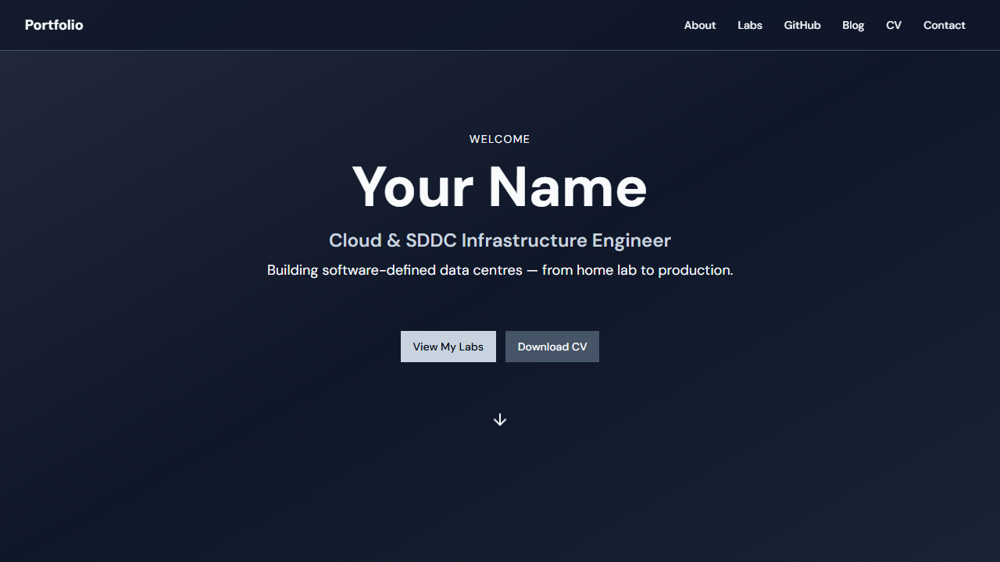

# My Lab Showcase




This project is a comprehensive portfolio designed to showcase hands-on technical labs, skills, and certifications. It features a public-facing showpiece and a powerful private admin panel for content management.

**URL**: 

## 🚀 User Journey & Features

### 1. The Public Portfolio
The entry point is a high-impact, responsive landing page designed to convert visitors into opportunities.

- **Hero Section**: (Shown above) Immediately establishes professional identity with a title, tagline, and social links.
- **Lab Grid**: A filterable grid of your engineering projects. Each card supports video previews and detailed technical breakdowns.
- **About & CV**: Dedicated sections for your biography and a direct download link for your resume.

### 2. The Admin Experience (Content Management)
Managing your portfolio should be as easy as building it. The `/admin` route provides a secure, local-first CMS.


- **Profile Editor**: Update your bio, title, and social links in real-time.
- **Skill Matrix**: Drag-and-drop or simple form entry to update your technical skills and proficiency levels.
- **Lab Creator**: A sophisticated form to add new projects. defining objectives, environments, and step-by-step processes.

### 3. Unified On-Device AI Narration 🤖
A unique feature of this portfolio is the **AI Narration Engine**.
- **Input**: You provide a video or screenshot of your lab.
- **Process**: The app leverages **Unified On-Device AI** — supporting **Google Gemini Nano** (Chrome), **Microsoft Edge AI**, and **Microsoft Foundry Local**.
- **Output**: It automatically generates a technical walkthrough and summary locally with maximum privacy and zero latency.

### 4. Lab Recorder Station (Advanced Showcase) 🎥
**New in v2.0**: A sophisticated, integrated recording suite for technical evidence.
- **Interactive Terminal**: Real in-browser Node.js environment powered by **WebContainer API** and `xterm.js`.
- **Universal Recorder**: Custom `rrweb` engine to capture perfect, low-latency DOM-event sessions from any lab environment.
- **Draft Workflow**: Seamless **Record → Preview → Save as Draft** lifecycle management.

> [!TIP]
> **Hiring Managers & Recruiter Info**: For a deep dive into the architecture, user stories, and IR35 value proposition of these features, see the [Project Showcase Documentation](./docs/PROJECT_SHOWCASE.md).

## 🛠️ How it was Built

This project uses a modern, robust technology stack focused on performance and developer experience.

- **Frontend Framework**: [React](https://react.dev/) with [TypeScript](https://www.typescriptlang.org/) for type-safe, component-based UI.
- **Build Tool**: [Vite](https://vitejs.dev/) for lightning-fast HMR and optimized production builds.
- **Styling**: [Tailwind CSS](https://tailwindcss.com/) combined with [shadcn/ui](https://ui.shadcn.com/) for beautiful, accessible components.
- **Data Persistence**: A custom `lib/data.ts` layer that abstracts `localStorage`, allowing the app to work entirely offline or be easily swapped for a backend like Supabase.
- **Automation**: Uses [Playwright](https://playwright.dev/) for end-to-end testing and screenshot generation (as seen in this documentation!).

## 💻 Tech Stack Overview

| Category | Technology | Usage |
| :--- | :--- | :--- |
| **Core** | React 18, TypeScript | UI Logic |
| **Styles** | Tailwind CSS, Lucide Icons | Visual Design |
| **Components** | Radix UI, shadcn/ui | Accessible Primitives |
| **Routing** | React Router DOM | Navigation |
| **State/Data** | TanStack Query, LocalStorage | Data Management |
| **Testing** | Vitest, Playwright | QA & Automation |

## 📦 Getting Started

### Installation
```sh
# 1. Clone the repo
git clone <YOUR_GIT_URL>

# 2. Install dependencies
npm i

# 3. Start development server
npm run dev
```

