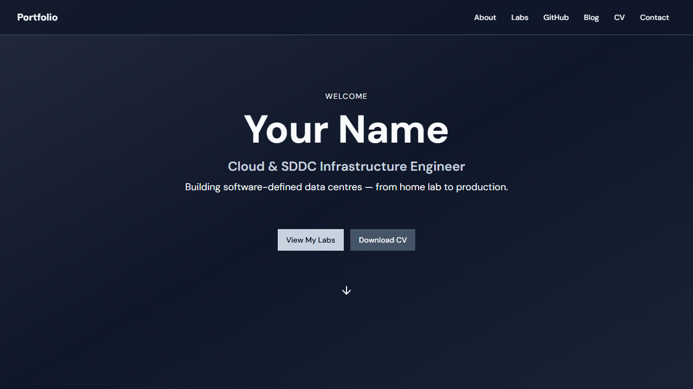
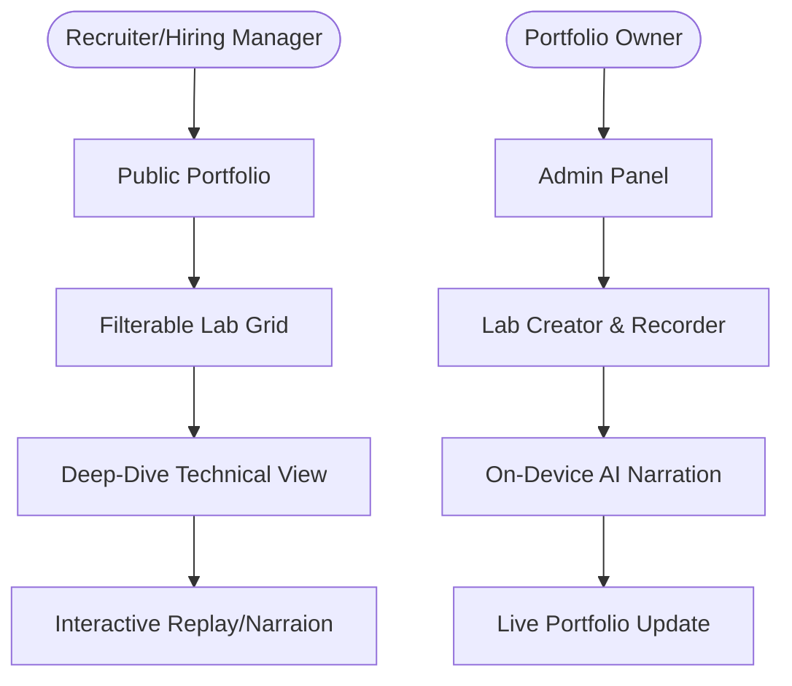
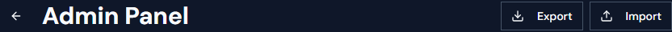
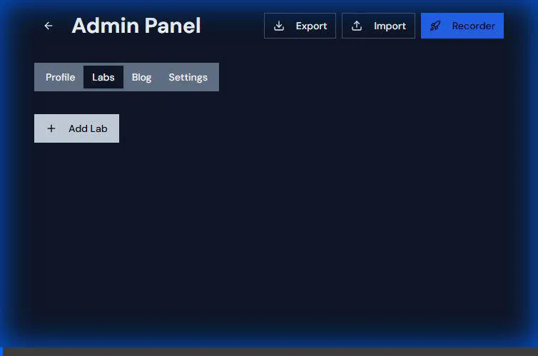
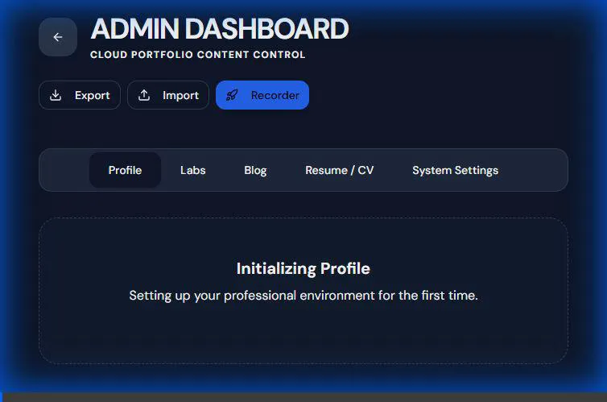
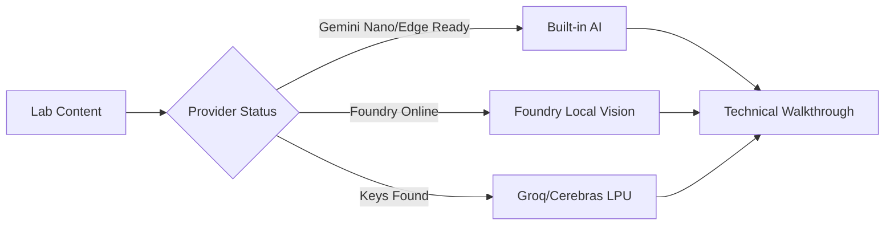

# My Lab Showcase




This project is a comprehensive portfolio designed to showcase hands-on technical labs, skills, and certifications. It features a public-facing showpiece and a powerful private admin panel for content management.

**URL**: [Live Demo](https://my-lab-showcase.netlify.app)
 
[](https://app.netlify.com/start/deploy?repository=https://github.com/andiekobbietks/my-lab-showcase)
[](./launch.bat)
[](https://stackblitz.com/github/andiekobbietks/my-lab-showcase)

## 🏗️ Backend Architecture: The Convex Shift

This project has been migrated from a local-only `localStorage` prototype to a high-performance, real-time backend powered by **Convex**.

### Why Convex?
- **Live Reactivity**: Every data change is pushed to the client in milliseconds. No more refreshing.
- **Type-Safe Schema**: The database structure is defined in TypeScript (`convex/schema.ts`), ensuring the UI never breaks due to mismatched data.
- **Scalable Recordings**: Lab recordings (rrweb) are now stored in a real database, allowing for complex, multi-minute sessions that exceed browser storage limits.
- **Serverless Actions**: Enables offloading heavy AI narration tasks to the cloud.

### Local Development with Convex
To run the project with the live backend features:
1.  **Install dependencies**: `npm install`
2.  **Initialize Convex**: `npx convex dev` (Follow the prompts to link your account).
3.  **Start Frontend**: `npm run dev`

---

## 🚀 The Evolution: From Prototype to Production

This project represents a journey through modern web architecture:

1.  **Phase 1: The Foundation**: A clean, responsive UI built with Vite, React, and Tailwind CSS, focused on showcasing static lab content and GitHub integration.
2.  **Phase 2: The Recorder Hub**: Addition of the **Lab Recorder Station**, allowing for the capture of complex ESXi/vSphere interactions using `rrweb`.
3.  **Phase 3: AI Intelligence**: Integration of the **Narration Engine**, providing automated technical walkthroughs for every lab.
4.  **Phase 4: The Reactive Shift**: A complete data layer migration to **Convex**, enabling real-time multi-device sync and robust cloud persistence.

---

## 🗺️ Strategic User Journey



> **Accessibility Caption**: This diagram shows two primary workflows. The Hiring Manager journey starts at the Public Portfolio, moves through a filterable Lab Grid to a Deep-Dive Technical View, and ends with Proof of work via interactive replays. The Portfolio Owner journey starts at the Admin Panel, moves to Create/Record, through AI Narration, and ends with Publishing to the live site.

## 🚀 User Journey & Features

### 1. The Public Portfolio
The entry point is a high-impact, responsive landing page designed to convert visitors into opportunities.

- **Hero Section**: (Shown above) Immediately establishes professional identity with a title, tagline, and social links.
- **Lab Grid**: A filterable grid of your engineering projects. Each card supports video previews and detailed technical breakdowns.
- **About & CV**: Dedicated sections for your biography and a direct download link for your resume.

### 2. The Admin Experience (Content Management)
Managing your portfolio should be as easy as building it. The `/admin` route provides a secure, local-first CMS.



- **Profile Editor**: Update your bio, title, and social links in real-time.
- **Skill Matrix**: Drag-and-drop or simple form entry to update your technical skills and proficiency levels.
- **Lab Creator**: A sophisticated form to add new projects. defining objectives, environments, and step-by-step processes.

#### 🎥 Technical Audit & Restoration
To ensure system integrity during the Convex migration, a full technical audit and restoration was performed on the Admin Dashboard.

| **Investigation (Audit)** | **Restoration (Success)** |
| :--- | :--- |
|  |  |

### 3. Context-Aware AI Suggestion Chips ⚡
**New in v2.1**: Real-time drafting assistance in the Admin panel.
- **How it works**: As you fill out your profile or lab details, the **local or resilient remote AI** provides suggestion chips for titles, objectives, and skills.
- **Benefit**: Speeds up documentation and ensures professional, consistent content across your portfolio.

### 4. Zero-Gap AI Resilience 🛡️
### 4. Unified AI Resilience (Gemini Nano, Foundry & Groq)
**User Story**: *"As a hiring manager, I want to see how the candidate ensures system reliability and performance."*
- **v2.2 Update**: Implemented a triple-layered AI lifecycle:
  1. **Primary**: Chrome/Edge Built-in AI (`window.ai`) for zero-latency, private inference.
  2. **Secondary**: Microsoft Foundry Local for high-fidelity technical vision tasks.
  3. **Resilience Fallback**: High-speed remote inference via **Groq** or **Cerebras** (fallback configured in Admin settings).
- **Benefit**: Proof of expertise in distributed AI systems, multi-provider integration, and "Zero-Gap" technical resiliency.

### ♾️ AI Resilience & Logic Flow



> **Accessibility Caption**: This flowchart illustrates the "Zero-Gap" AI logic. Lab content serves as input. The status is detected across three tiers: Browser AI (Primary), Foundry Local (Secondary), and Remote Fallback (Groq/Cerebras). All tiers converge to generate the final Technical Walkthrough narration.

### 4. Lab Recorder Station (Advanced Showcase) 🎥
A sophisticated, integrated recording suite for technical evidence.
- **Manual Mode**: Inject `rrweb` into any technical interface (vSphere, Azure, AWS) to record high-fidelity DOM sessions.
- **Terminal Mode**: A built-in **Interactive WebContainer Terminal** for practicing and recording CLI workflows.
- **Narrate Flow**: One-click AI narration using your on-device models to turn recordings into searchable technical guides.

## 🧠 Tech Stack Deep-Dive
- **Frontend**: React, Tailwind CSS, Lucide React, Radix UI.
- **On-Device AI**: Google Gemini Nano (Prompt API), Microsoft Edge AI, Microsoft Foundry Local.
- **Terminal**: StackBlitz WebContainers, xterm.js.
- **Recording**: rrweb (Record and Replay the Web).

## 🚀 Deployment & Security
- **Netlify**: Configured with strict **COOP/COEP** headers for WebContainer safety.
- **Privacy**: Local-first AI ensures your lab data never leaves the browser.

> [!TIP]
> **Hiring Managers & Recruiter Info**: For a deep dive into the architecture, user stories, and IR35 value proposition of these features, see the [Project Showcase Documentation](./docs/PROJECT_SHOWCASE.md).
 
## 🎡 One-Click Deployment & Clean-Up
 
### 🌐 Deploy to Netlify
Click the **Deploy to Netlify** button at the top of this README to clone and host this portfolio in seconds. 
- **To take it down**: Log in to your [Netlify Dashboard](https://app.netlify.com), go to `Site Settings` -> `Danger Zone` -> `Delete Site`.
 
### 💻 One-Click Local Launch
If you have the repo cloned locally:
- **Windows**: Double-click [launch.bat](./launch.bat)
- **Mac/Linux**: Run `sh launch.sh` inside the terminal.

## 🛠️ How it was Built

This project uses a modern, robust technology stack focused on performance and developer experience.

- **Frontend Framework**: [React](https://react.dev/) with [TypeScript](https://www.typescriptlang.org/) for type-safe, component-based UI.
- **Build Tool**: [Vite](https://vitejs.dev/) for lightning-fast HMR and optimized production builds.
- **Styling**: [Tailwind CSS](https://tailwindcss.com/) combined with [shadcn/ui](https://ui.shadcn.com/) for beautiful, accessible components.
- **Data Persistence**: A custom `lib/data.ts` layer that abstracts `localStorage`, allowing the app to work entirely offline or be easily swapped for a backend like Supabase.
- **Automation**: Uses [Playwright](https://playwright.dev/) for end-to-end testing and screenshot generation (as seen in this documentation!).

## 💻 Tech Stack Overview

| Category | Technology | Usage |
| :--- | :--- | :--- |
| **Core** | React 18, TypeScript | UI Logic |
| **Styles** | Tailwind CSS, Lucide Icons | Visual Design |
| **Components** | Radix UI, shadcn/ui | Accessible Primitives |
| **Routing** | React Router DOM | Navigation |
| **State/Data** | TanStack Query, LocalStorage | Data Management |
| **Testing** | Vitest, Playwright | QA & Automation |

## 📦 Getting Started

### Installation
```sh
# 1. Clone the repo
git clone <YOUR_GIT_URL>

# 2. Install dependencies
npm i

# 3. Start development server
npm run dev
```

