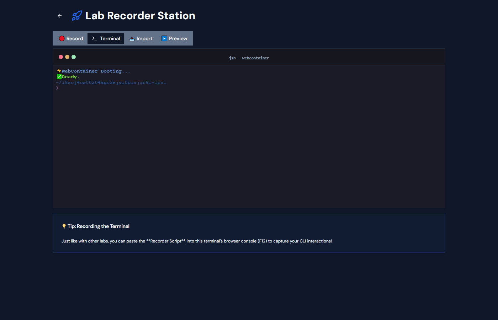

# Technical Showcase: Lab Recorder Station & Interactive Shell 🚀

> **Strategic Positioning**: This project demonstrates senior-level proficiency in browser-based runtimes, security (Cross-Origin Isolation), and advanced UX utility. It provides high-value evidence for both inside and outside IR35 contracting roles.

## 🌟 Executive Summary
I have engineered a **Lab Recorder Station** integrated directly into the portfolio's Admin panel. This enables the rapid creation of high-fidelity, interactive lab demonstrations by capturing real user interactions from both external web clients (vSphere/ESXi) and an internal, in-browser Node.js runtime.

---

## 🏎️ Key Features & User Stories

### 🤖 Zero-Gap AI Resilience
The **AI Narration Engine** now supports a triple-tier fallback system:
- **Tier 1 (Browser)**: Chrome Gemini Nano / Edge Phi-4-mini via the Prompt API.
- **Tier 2 (Local)**: Microsoft Foundry Local for high-fidelity vision tasks.
- **Tier 3 (Resilient Remote)**: High-speed inference via **Groq** or **Cerebras** (configured in Admin → Settings).
- **Privacy First**: API keys and model preferences are stored exclusively in `localStorage`.

## Key Files
| [foundry-local.ts](file:///c:/Users/LLM-Test/MyLabsPortfolioSite/my-lab-showcase/src/lib/foundry-local.ts) | Unified Resilient AI Bridge |
| [Admin.tsx](file:///c:/Users/LLM-Test/MyLabsPortfolioSite/my-lab-showcase/src/pages/Admin.tsx) | Settings & Multi-provider status UI |
| [SuggestionChips.tsx](file:///c:/Users/LLM-Test/MyLabsPortfolioSite/my-lab-showcase/src/components/SuggestionChips.tsx) | Context-aware UI assistant |
### 3. The Universal Recorder (rrweb Engine)
**User Story**: *"As a project lead, I need tools that streamline evidence collection and training."*
- **Implementation**: Custom injection of `rrweb` into target iframes and external tabs with full session control (Pause/Resume/Stop).
- **Benefit**: Captures 100% reproducible sessions (not just video, but DOM events), allowing for searchable, interactive replays.

### 3. Draft & Lifecycle Management
**User Story**: *"As a recruiter, I want to see a polished, end-to-end workflow."*
- **Implementation**: A seamless Pipeline: **Record → Preview → Save as Draft → Publish**.
- **Visuals**: Dynamic "DRAFT" and "🎥 Recording" badges in the Admin panel.

---

## 🛠️ Architecture Deep Dive

### Security: Cross-Origin Isolation
To enable WebContainers, the application implements **Cross-Origin Embedder Policy (require-corp)** and **Cross-Origin Opener Policy (same-origin)**. This unlocks `SharedArrayBuffer` support, required for the backend Node.js process to signal the main thread.

### The Recorder Script
The injected recording script is a masterpiece of utility, providing the user with a "Command Center" in the browser console:
```javascript
pause();    // ⏸️ Pause events
resume();   // ▶️ Resume capture
status();   // 📊 Health check
stop();     // 🛑 Build JSON export
```

---

## 💼 Hiring & IR35 Value Proposition

### Proving Expertise (Outside IR35)
This project is a perfect example of a **defined deliverable** with a clear **statement of work**. It shows I can independently design, implement, and document a complex subsystem (The Recorder Station) from scratch, delivering a specific business utility.

### Technical Seniority (Inside IR35)
Demonstrates immediate impact on internal tools and DX (Developer Experience). I'm not just writing code; I'm building tools that make the whole team faster at creating high-quality lab content.

---

## 📸 Guided Tour

### Admin Dashboard Overview


### The Interactive Terminal


### Session Recording & Draft Management

